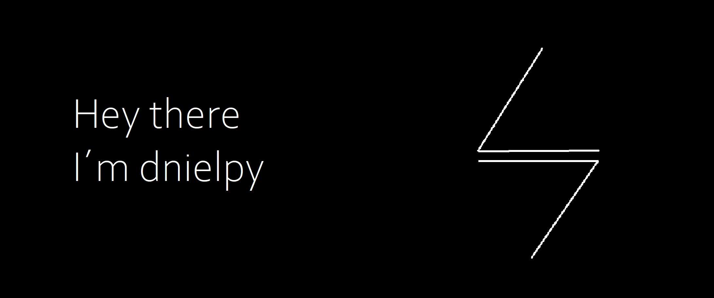

<h2> &#8203 &#8203
	
	
</h3>
<!--horizontal divider(gradiant)-->

<!--h1 without bottom border-->

  <ul align="center">
    
<h1 style="display: inline-block">Hi 👋, I'm Dnielpy</h1>

  </ul>

<!--- snake -->

  

<!--h2 without bottom border-->

  <ul align="center">
    
<h2 style="display: inline-block">Confusion is part of Programming</h2>

  </ul>

<!--Intro start-->
- 💻 Backend Developer
- ☕️ JavaDev 

<!--tech stack icons-->

  

<!--Intro end-->

----------------------------------------------------------------------
